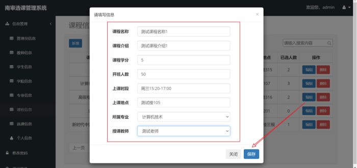

系统架构：


七张表：


八个实体：


系统首页：


课程信息：


新增跟编辑的模态框：


模糊查询：


学生身份选课：


老师身份查看：


管理员身份查看：

## 一、Java框架

国内最流行的后端技术栈是java的ssm(Spring, SpringMVC, Mybatis)。最新的是Springboot以及SpringCloud

1. Spring是Spring系列的基石，主要有两个理念：**IOC和AOP**，IOC是控制反转的意思，代表着把对象创建的权利从程序员转移到框架上去，在Java里面传统思想是程序员自己手动new一个对象出来。这里列举两个需要用到IOC的场景：

   - IOC通过DI(依赖注入)的方式保证了每个类都是单例，那么在需要使用到这个类的某些能力的时候，只需要调用这个类的唯一单例就行。如果交给程序员来new不能保证只有一个单例，并且如何把这个对象共享到其他类也是一个难题。全局保证**一个类只有一个实例对象**就能极大节约资源，提高速度
   - 有些时候程序在运行时才会知道要实例哪些对象，而并不是在编译前就提前知道的。比如有一个接口Animal，三个实现类Cat, Dog, Bird。在程序运行之前，并不知道用户会使用哪一个实现类，那么就不能在程序里写死new，可以在外部资源文件(比如properties)指定需要加载哪个类，程序在**运行的时候就可以通过指定外部资源来创建所需的对象**(基于反射)

   AOP是一种**无侵入**的思想，比如现在有一个电商系统，用户下单的时候需要将商品的各种信息保存到数据库。但是现在有一个需求，在下单的同时需要将下单的创建时间和创建人也一并保存到数据库，推广一下，不只是下单，包括用户创建地址的时候也需要将创建时间以及创建人保存到数据库。对于这一类非核心的但是需要的公共字段就可以用AOP来处理，我们只需要抽离公共字段(创建人，创建时间，修改人，修改时间)通过AOP就能实现**无需改动原核心代码**就能实现以上需求

2. SpringMVC是基于Spring两大理念上做的一个web框架，六七年前用的很多，现在由于Springboot已经用的很少了

3. Springboot是因为Spring跟SpringMVC配置特别麻烦而提出来的一个轻量级框架。在Springboot讲究**约定大于配置**，通过“约定”就能避免配置大量繁琐的文件，除非真的要做特别定制需求才会去配置，这种开箱即用的特性简化了开发流程

4. SpringCloud是基于Springboot的，因为Springboot是单体项目，所有功能聚合在一起。在用户流量特别大的时候，其实需要将各个模块拆分到不同服务器上**分散压力**，就算宕机也能对外提供服务。比如SpringCloud就会将电商系统的订单模块，购物车模块，商品模块拆分到不同服务器上面

5. Mybatis是一个**数据库对象映射**框架，Mybatis将数据库里面的一张表映射成了Java里面一个对象，表里面的字段就是对象里面的字段，比如有一张user表(两字段user_id, user_name)，那么对应User类(两字段userId, userName)。Mybatis就相当于Java代码跟数据库的缓冲区

## 二、后端思想

后端开发思想是MVC，这种思想存在于各种后端语言中。M代表数据，V代表视图，C代表控制器。当用户在前端地址栏请求一个url资源，那么首先会访问到控制器，控制器会对这次请求进行分析，比如是什么类型的请求GET?POST?，有没有带路径参数等等。处理好之后会交给M修改数据，最后通过V返回前端。比如一个请求是：POST /goods/update/?id=12，其中的Body参数为{price:999, inventory:20}，商家在管理端希望将编号为12的商品修改价格为999，库存为20件。控制器接收到该路径后交给mapper(java中调用mybatis)修改好数据，再通过V将更新后的数据返回给前端，让用户看到最新的状态


## 三、前端

前端是MVVM思想：

- Model：数据模型，存放用于展示的数据，有的数据是写死的，大多数是从后端返回的数据
- View：视图，用于界面，在前端我们可以理解为Dom操作
- ViewModel：视图模型，可实现数据的双向绑定，连接View和Model的桥梁，当数据变化时，ViewModel够监听到数据的变化（通过Data Bindings），自动更新视图，而当用户操作视图，ViewModel也能监听到视图的变化（通过DOM Listeners），然后通知数据做改动，这就实现了数据的双向绑定

在国内最流行的典型前端框架就是Vue，并衍生出Uniapp(一套代码多端编译)，Vue-Router(路由)，Pinia(状态管理)，UseVue等等产品。Vue的核心理念就是**响应式数据**(承担了ViewModel的职责)，这意味着数据会自动响应变化而无需程序员手动修改。比如：

1. 在购物车里用户修改了单品数量，购物车计算总价会自动响应变化，实时显示出总价，这一点就不需要程序员编写函数监听数据再去修改数据了，因为Vue里面提供的就是**数据绑定**
2. 在很多系统里面都有推荐系统，类似于猜你喜欢，这种需求往往是先给出一定的数据(比如10个)，当用户往下滑动到底部的时候再发起请求，此时页面下方会**自动刷新出一些数据**。实现原理是用一个响应式变量DataList接收返回的数据，当发生触底事件时再发起请求，并把新的数据追加到DataList后面，框架会监听到DataList发生改变了，那么会通过列表渲染在前端界面自动加载新的数据


vue react angluar

ajax

REST

- get  select
- post  insert
- put  update
- delete delete

maven

requiresment.txt

JavaBean

- getter
- setter
- 构造器
- Data toString


vue bootstrap axois


orm 


```java
//java中使用一个user.name
class User{
    private String name;
    //getter setter 构造器
}
User user = new User("admin")
```

```javascript
//js中使用user.name
user = {}
user.name = "admin"
```

> 软编码：比如开发一个贪吃蛇游戏，定义屏幕的宽度和高度
>
> int WIDTH,HEIGHT = 800 800      *
>
> 那么在之后需要用到边界的时候，只需要引用变量就可以了，比如
>
> if (snake.x>=WIDTH) { return -1;}
>
> else { return 0}
>
> 如果需要更改游戏界面大小，只需要在最开始的*地方修改一处就行了

- 学院->部门->专业

- 管理员编辑课程，学生选课，教师通过
- 只有登录页需要校验身份，用不着每一次请求后端服务之前都去数据库鉴别一次身份是否正确(无意义且浪费资源)。因此在登录鉴别成功之后，把相关信息保存到本次会话。同理前端把校验正确的信息存放到localStorage，避免不必要开销
- 在类上打@RestController @Service @Mapper，就意味着把这些类实例化一个唯一的对象，并且加入到spring容器里（把汤圆下锅）
- 在需要使用的地方加入@Autowired，就代表从容器里取出该类型的对象使用（把汤圆装进碗里）
- 生命周期函数（也叫作钩子函数），这是在某个特定周期会触发的函数，有点类似于Python类里面的\_\_init\_\_   \_\_del\_\_  。在浏览器页面就有加载时，销毁时等等时机
- 以json传送的数据要加@Requestbody
- 通过v-if结合level控制权限
- 所有标签里面的class属性都只是控制样式，不涉及代码逻辑
- SELECT * FROM student_info limit 4,3 是从第四行开始(包括这一行)，返回三行数据。mysql索引从零开始。使用PageHelper有两个好处：
  - 不用自己写sql语句的limit
  - 额外返回上下页信息
- 回显

> {
>
> ​	"pageNum":1,
>
> ​	"pageSize":5
>
> }模糊查询
>
> http://localhost:8888/collegeInfo/page/search?pageNum=1&pageSize=5

- 在很多场景下，新增跟编辑是复用一个组件（因为数据基本一样），那么怎么区分是新增还是编辑？通过id。因为新增还没有把数据插入到数据库里面，那么就不存在id。但是对于编辑，数据是已经从数据库里面返回的，那么一定存在id
- 软编码概念很广泛，包括数据库里面一张表存放另一张表的主键id来实现两张表关联


编译型

解释型

selenium


1. 左连接（LEFT JOIN）：返回左表中的所有行，以及右表中满足连接条件的行。如果右表中没有匹配的行，则结果集中将包含 NULL 值。

```mysql
sqlCopy codeSELECT * 
FROM table1
LEFT JOIN table2 ON table1.column = table2.column;
```

2. 右连接（RIGHT JOIN）：与左连接类似，但返回右表中的所有行，以及左表中满足连接条件的行。如果左表中没有匹配的行，则结果集中将包含 NULL 值。

```mysql
sqlCopy codeSELECT * 
FROM table1
RIGHT JOIN table2 ON table1.column = table2.column;
```

3. 全连接（FULL OUTER JOIN）：返回两个表中的所有行，无论是否满足连接条件。如果某一行在其中一个表中没有匹配行，则另一个表中对应位置的列将包含 NULL 值。

```mysql
sqlCopy codeSELECT * 
FROM table1
FULL OUTER JOIN table2 ON table1.column = table2.column;
```

假设我们有两个表格：一个存储有关用户的信息（users），另一个存储有关用户订单的信息（orders）。我们想要获取每个用户以及他们的订单信息。如果某个用户没有订单，我们也想要包括该用户在结果中，并且在订单信息中显示 NULL。

下面是这两个表的简化示例：

**users** 表：

```mysql
| user_id | username |
|---------|----------|
| 1       | Alice    |
| 2       | Bob      |
| 3       | Charlie  |
```

**orders** 表：

```mysql
| order_id | user_id | product  |
|----------|---------|----------|
| 101      | 1       | Product1 |
| 102      | 1       | Product2 |
| 103      | 3       | Product3 |
```

现在，我们可以使用左连接来获取每个用户及其订单信息。左连接将返回左表（users）中的所有行，并与右表（orders）中匹配的行相结合。如果某个用户没有订单，那么订单信息列将显示为 NULL。

```mysql
sqlCopy codeSELECT u.username, o.order_id, o.product
FROM users u
LEFT JOIN orders o ON u.user_id = o.user_id;
```

执行以上查询后，我们将获得如下结果：

```mysql
| username | order_id | product  |
|----------|----------|----------|
| Alice    | 101      | Product1 |
| Alice    | 102      | Product2 |
| Bob      | NULL     | NULL     |
| Charlie  | 103      | Product3 |
```

可以看到，结果包含了所有用户，即使其中一些用户（如 Bob）没有订单，其订单信息列显示为 NULL。这就是左连接的作用：它返回左表中的所有行，以及与右表中匹配的行，如果没有匹配的行则显示为 NULL。

什么连接就优先考虑什么，“什么一定要列完”


为什么要用PageHelper这类第三方库？因为原生的Limit语句很不好用   a,b。从第a(从第0行开始包括第a行)行开始返回b条数据 limit 1,5


:disable，如果条件成立那么禁用


数据库中的表==Java中的实体类==前端中的一个表单

数据库中的表中的一条记录==Java中实体类的对象

数据库中的表的**字段**==Java中实体类的**属性**==前端中**一个表单项**
